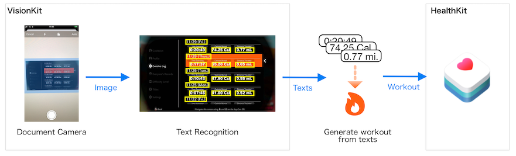
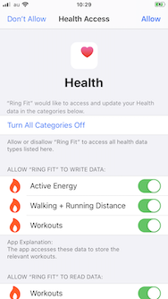
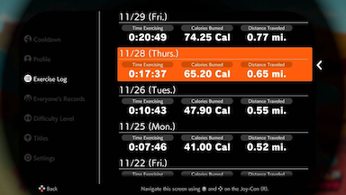
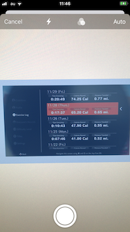
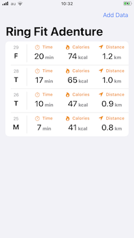
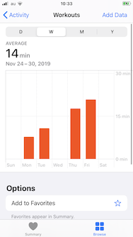
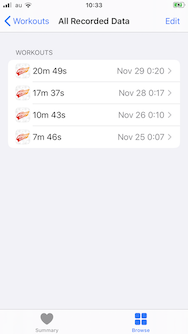
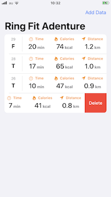

# Ring Fit Connect

This app allows you to import your [Ring Fit Adventure](https://ringfitadventure.nintendo.com) workout logs into Health Care (HealthKit) on your iPhone.

- [Getting Started](#getting-started)
    - [Requirements](#requirements)
    - [Build](#build)
- [Usage](#usage)
    - [Granting access to health data](#granting-access-to-health-data)
    - [Importing Workout](#importing-workout)
    - [Deleting Workout](#deleting-workout)
- [FAQ](#faq)
- [Author](#author)
- [License](#license)

## Getting Started

### Requirements

* iOS 13.1+
* Xcode 11.5
* Swift 5.0

### Build

1. Download the source code from github and open it in Xcode.
2. Change the code signing settings to your developer account.
3. Connect the device to mac and press the Run button.

## Usage

### Granting access to health data

- The HealthKit permissions dialog will be displayed the first time you launch the app.
- Please give permissions to all the categories displayed.  
    

### Importing Workout

1. Launch Ring Fit Adventure on the Nintendo Switch.
2. At any point while playing a game mode, press the B Button on the Joy-Con to access “My Menu”. 
3. Use the control stick on the Joy-Con to highlight "Exercise Log", then press the X Button. 
     [(Screen image from KoopaTV)](https://www.koopatv.org/2019/11/ring-fit-adventure-fitness-log-week-3.html)
4. Launch the app and press the Add Data button.
5. As the camera starts up, take a picture of the "Exercise Log" screen and press the Save button. 
    
6. If the recognition is successful, the Workout will be imported into HealthKit and listed on the screen. 
     

### Deleting Workout

- You can delete a listed workout by swiping on it. 
    

## FAQ

### Unable to import workouts.

Since the text is recognized from the image taken by the camera, it cannot be recognized if the screen is reflective or far away from the screen.

### Can't import workouts when I take a picture of "Today's Results" screen.

The "Today's Results" screen, which is displayed at the end of fitness, is not supported. 
Please take a picture of the "Exercise Log" screen displayed in My Menu.

### Multiple log screens have been taken, but only the first screen is recognized.

At the moment, only the data from the first screenshot is imported.
All screenshots other than the first one will be ignored.

### Can I import excesize details?

No, this app can only capture the three values that appear on the "Exercise Log" screen. (Time Exercising, Calories Burned and Distance Traveled)

### Which languages are supported by the Switch's language settings?

At the moment, only English and Japanese are supported.

## Author

Watanabe Toshinori – toshinori_watanabe@tiny.blue

## License

This project is licensed under the MIT License. See the [LICENSE](LICENSE) file for details.
